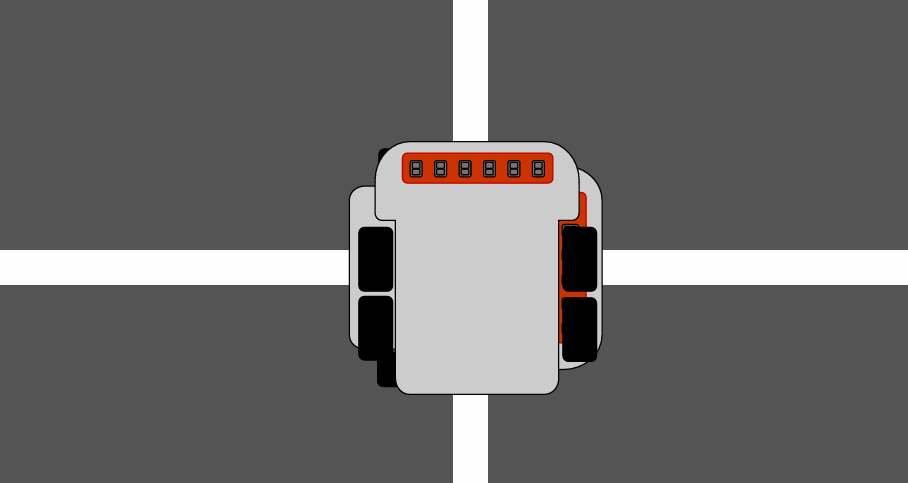

# 🗺️ 미로 탐색(Maze Solving)

## 문서 개요
#### 1. Wall Follower 기법 소개
#### 2. 장점·단점 정리
#### 3. 좌수법(Left-Hand Rule) 알고리즘 흐름

 

### 1. Wall Follower 기법 소개
> *미로 벽을 따라가며 출구를 찾는 기본 탐색 방법을 설명합니다.*

- **Wall Follower** : 미로의 벽을 따라서 진행하여 미로의 출구를 찾는 알고리즘
- **좌수법(Left-Hand Rule)** : 왼쪽 벽을 따라서 진행
- **우수법(Right-Hand Rule)** : 오른쪽 벽을 따라서 진행

### 2. 장점·단점 정리
| 구분 | 장점 | 단점 |
|-|-|-|
| Wall Follower | • 구현이 매우 단순   • 입·출구 정보 불필요   • 외곽 벽 연결 시 반드시 탈출 | • 최단 경로 보장 불가   • 회문형 미로에서 실패   • 내부 시작점 한계 |

### 3. 좌수법(Left-Hand Rule) 알고리즘 흐름
> *왼쪽 벽과 센서값을 활용하여 분기점에서 이동 방향을 결정하는 절차를 정리합니다.*

1. **출발** : 시작점에서 양쪽 끝 센서에 라인이 감지되지 않을 때까지 전진한다.

2. **시작** : 양쪽 끝 센서에 라인이 감지되지 않으면 이때를 시작으로 한다.

 

3. **갈림길 감지** : 양쪽 끝 센서에 라인이 감지되는 경우, 이는 갈림길 혹은 목적지이다. 이후 차량을 조금 전진해 가운데 라인을 감지하여 갈림길의 종류를 확정한다.

 

4. **이동 우선순위** : 갈림길에서는 좌측-전진-우측의 우선순위로 진행한다.

 

5. **막다른 길** : 모든 센서에 라인이 감지되지 않는 경우, 180도 회전한다.

 

6. **출구 판별** : 만약 `갈림길 감지`를 해서 조금 전진했는데 그래도 좌/우측 갈림길이 존재하면 이 지점이 출구이다.
