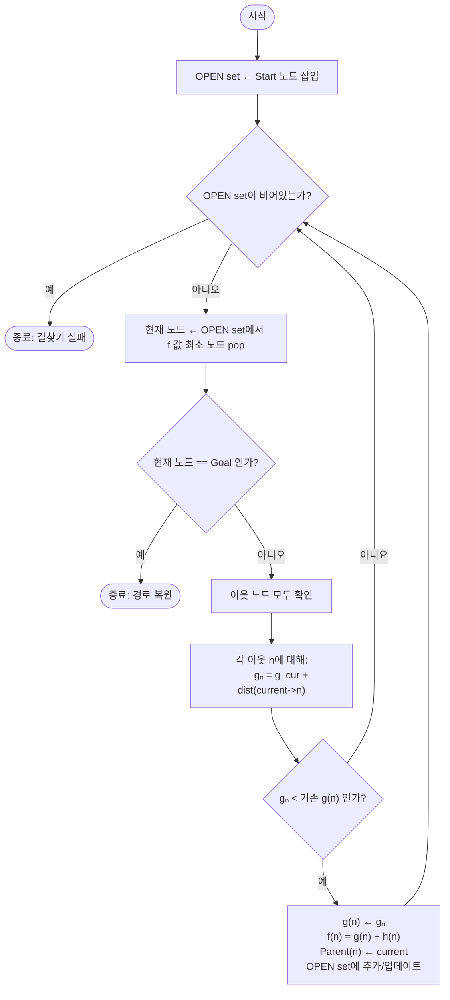

# 🅰️ A* Algorithm
## 문서 개요
#### 1️⃣ A* 알고리즘 개요
#### 2️⃣ A* 알고리즘 - 동작
#### 3️⃣ A* 알고리즘 - 기본 변수 설정
---
 

## 1️⃣ A* 알고리즘 개요
### 1. 목적
- 출발점(start)과 목표점(goal)을 연결하는 최단 경로 탐색
- 시작점과 목표점의 좌표 정보를 **반드시**알고 있어야 함

### 2. 휴리스틱 함수 `h(x)`
- 각 노드에 대하여 휴리스틱 함수 h(x)를 설정하여, 이를 최적 길찾기에 활용

- 휴리스틱 알고리즘의 정확도에 따라 길찾기 성능이 결정

### 3. 비용 함수 `f(x)`
- 최적 경로 탐색을 위한 우선순위 값

- $f(x) = g(x) + h(x)$

    - `g(x)` : Node x까지 실제 거리  
    - `h(x)` : x부터 목적지까지 추정 거리

 

## 2️⃣ A* 알고리즘 동작

## 3️⃣ A* 알고리즘 - 기본 변수 설정
| 목적 | 타입 | 변수명 |
|-|-|-|
| **맵 사이즈 x** | `int` | size_x |
| **맵 사이즈 y** | `int` | size_y |
| **노드 구조체** | `node` | x,y,F,G,H ||
| **우선순위 큐** | `PriorityQueue` | open_node |
| **목적지 x** | `uint_8` | dest_x |
| **목적지 y** | `uint_8` | dest_y |
| **G값 비교를 위한 배열** | `int[][]` | openG |
| **부모노드 저장 배열** | `uint_8[][]` | parents |